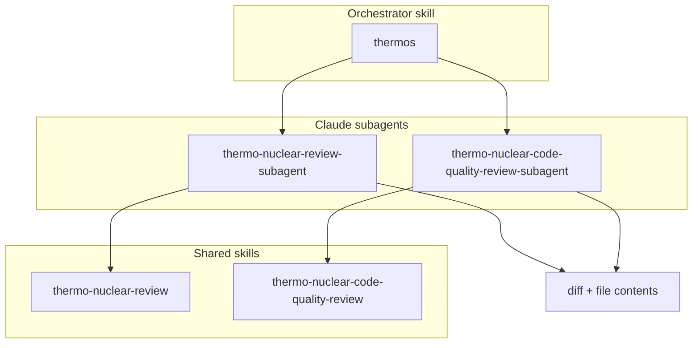

# Thermos plugin

Thermo-nuclear branch review: deep correctness and security audits, a strict maintainability rubric, parallel review subagents, and combined synthesis.

This tree is a **single common core served to multiple agent harnesses** (Claude Code and Codex-like harnesses) through thin per-harness adapter files. Each harness reads only its own manifest and ignores the other's files, so the shared skills stay authored once.

## Layout

```
plugins/thermos/
├── skills/                         # Shared core — harness-neutral, authored once
│   ├── thermos/                    #   orchestrator: paired passes + synthesis
│   ├── thermo-nuclear-review/      #   correctness/security rubric
│   └── thermo-nuclear-code-quality-review/  # maintainability rubric
│       ├── SKILL.md                #   the skill
│       ├── references/*.md         #   progressive-disclosure detail
│       └── agents/openai.yaml      #   Codex per-skill interface metadata (see note)
├── agents/*.md                     # Claude subagents (shared source, Claude-only consumer)
├── .claude-plugin/plugin.json      # Claude adapter manifest
├── .codex-plugin/plugin.json       # Codex adapter manifest
├── assets/logo.png                 # Shared
├── CHANGELOG.md                    # Provenance of each adaptation
└── LICENSE
```

## Adapter boundary

| Concern | Claude Code | Codex-like |
|:--------|:------------|:-----------|
| Manifest | `.claude-plugin/plugin.json` | `.codex-plugin/plugin.json` |
| Skills | auto-discovered from `skills/` | declared via `"skills": "./skills/"` |
| Review subagents | auto-discovered from `agents/*.md` | not consumed (no subagent construct) |
| Per-skill interface | not consumed | `skills/<name>/agents/openai.yaml` |
| Marketplace | repo-root `.claude-plugin/marketplace.json` | `~/.agents/plugins/marketplace.json` |

The Claude manifest deliberately carries **no** `agents`/`skills` path overrides: a directory-string override for `agents` fails `claude plugin validate`, and default auto-discovery of `skills/` and `agents/` already covers both. The Codex manifest declares only `skills` plus its `interface` block, so Codex never loads the root `agents/`.

### Two directories named `agents/`

The tree contains two unrelated things both named `agents/`, at different depths — a collision imposed by the two harness formats, **not renamable** without breaking discovery:

- `agents/*.md` (plugin root) — Claude dispatchable **subagents**. Shared source; only Claude discovers them.
- `skills/<name>/agents/openai.yaml` (nested) — Codex per-skill **interface metadata** (display name, default prompt). Tiny, and consumed only by Codex.

When editing "the agents," confirm which of the two you mean.

## Architecture



On Claude the `thermos` orchestrator dispatches the two subagents in parallel; each applies its shared skill rubric to the same scoped diff. On harnesses without a subagent construct, `thermos` runs the two passes sequentially and keeps findings separate until synthesis.

## Components

### Skills (shared)

| Skill | Purpose |
|:------|:--------|
| `thermo-nuclear-review` | Deep branch audit: bugs, breakages, security, devex regressions, feature-gate leaks. |
| `thermo-nuclear-code-quality-review` | Strict maintainability audit: code-judo, file-size pressure, spaghetti, boundaries. |
| `thermos` | Run both passes and synthesize deduplicated, severity-ordered findings. |

### Subagents (Claude-discovered)

| Subagent | Purpose |
|:---------|:--------|
| `thermo-nuclear-review-subagent` | Dispatchable wrapper that applies the `thermo-nuclear-review` rubric to a scoped diff. |
| `thermo-nuclear-code-quality-review-subagent` | Dispatchable wrapper that applies the `thermo-nuclear-code-quality-review` rubric to a scoped diff. |

## Maintenance notes

- **Keep the two manifest `description` fields paired.** They differ only by the ` for Codex` qualifier and the omission of the `parallel review subagents` clause (Codex has no subagent construct). Mirror any other wording change across both.
- **Versioning.** Both manifests use semver build metadata (`<semver>+claude.<ts>`, `<semver>+codex.<ts>`) to disambiguate the artifacts. Build metadata after `+` does not affect version precedence, so a real release that should trigger an update check must bump `MAJOR.MINOR.PATCH` (or use a pre-release identifier before the `+`) — a new timestamp alone reads as the same version.
- **Codex installs are cached copies.** Codex reads the local marketplace source when installing, validates the Codex manifest and declared skill surface, and writes a copied cache under `~/.codex/plugins/cache/`. Source edits need a fresh Codex build-metadata cachebuster, `codex plugin add thermos@personal`, and a new Codex thread. The cache may include root Claude files and docs copied from the source tree, but the Codex runtime component surface remains the Codex-declared surface: `.codex-plugin/plugin.json`, `skills/`, nested `skills/<name>/agents/openai.yaml`, referenced skill files, and shared assets.
- **Claude installs are cached copies.** After editing this tree, run `claude plugin marketplace update <marketplace>` and update/reinstall the plugin; the running session needs a restart to pick up a new plugin version.
- **Attribution.** Codex attribution lives in this README and [CHANGELOG.md](CHANGELOG.md). The Codex manifest uses only fields accepted by Codex validation.

## Upstream

Adapted from the Cursor team's Thermos plugin: [cursor/plugins](https://github.com/cursor/plugins/tree/main/thermos). See [CHANGELOG.md](CHANGELOG.md) for the provenance of each adaptation.

## License

MIT
